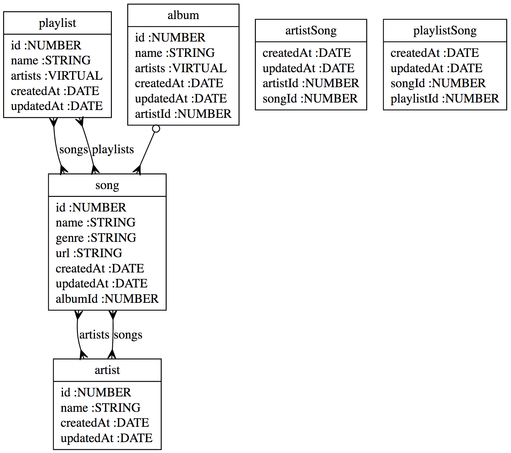

# Sequelize ERD

This package takes your sequelize models and produces ERD diagrams of them.



It should be noted that the implimentation is a bit hacky. Its built on top of [mdaines](https://github.com/mdaines)'s [vis.js](https://github.com/mdaines/viz.js/) which is described as "a hack to put Graphvis on the web." It seems like it was recently taken off NPM, so it isn't included as a dependency but instead in this package.

## Installation

You _don't_ need Graphviz or any non-javascript software to use this. Just

```bash
$ npm install sequelize-erd --save-dev
```

## API

Exported from `sequelize-erd` is a function which takes your models. It can either take the `sequelize` instance or a path to a file to require. The function returns an svg of the models.

```
const db = new Sequelize();
// Import DB models here

const svg = sequelizeErd({ source: db });
writeFileSync('./erd.svg', svg);

// Writes erd.svg to local path with SVG file from your Sequelize models
```

## From bash

### Options

- `source` relative path from project root to js file containing sequelize object with models loaded
- `destination` Where you want your ERD SVG
- `include` Only include the following models
- `exclude` Exclude the following models
- `format` File format. Options are "svg", "dot", "xdot", "plain", "plain-ext", "ps", "ps2", "json", "json0"
- `engine` Layout engine to use, options are "circo", "dot", "fdp", "neato", "osage", "twopi". Default to "circo"

We expose a binary for you to use as a npm script. If you want an erd diagram generated in your project folder every time you commit, add this to your package json.

The source path specifies a js file that must export your Sequelize DB instance. It also needs to load all your models.

```json
{
  "scripts": {
    "erd": "sequelize-erd --source ./path/to/your/sequelize/instance --destination ./erd.svg"
  }
}
```
